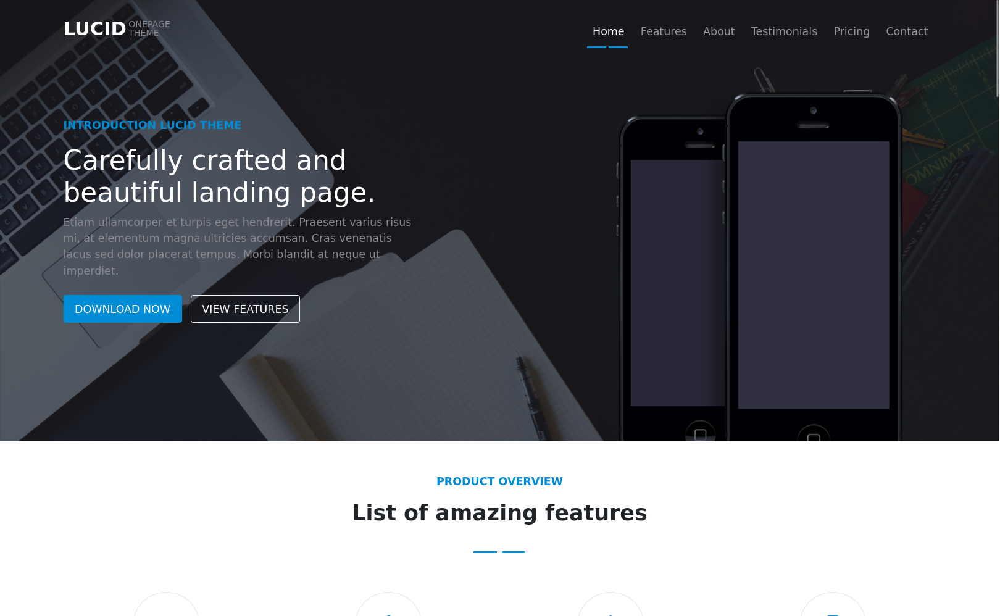

# Lucid - Responsive Landing Page

This is the repository for "Lucid," a clean, modern, and fully responsive onepage theme. This project is designed to showcase a product in an engaging and elegant way.

## ✨ Demo

You can view the live version of the site at this link:
**[https://solidarov.github.io/lucid-landing-page/](https://solidarov.github.io/lucid-landing-page/)**




## 🚀 Features

* **Fully Responsive Design:** Looks great on all devices, from mobile phones to desktops.
* **Modern UI/UX:** A clean and minimalist user-centric design.
* **Smooth Scrolling:** Easy navigation between site sections.
* **Multi-Section Layout:** Includes all essential sections for a landing page:
    * **Home:** An attractive main screen.
    * **Features:** An overview of key features.
    * **About:** Detailed product description.
    * **Testimonials:** A slider with customer reviews.
    * **Pricing:** A table with pricing plans.
    * **Contact:** A contact form and contact information.

## 🛠️ Technologies Used

This project is built using modern web technologies:

* **HTML5:** For the semantic structure of the site.
* **SCSS (Sass):** For writing clean, structured, and modular CSS.
* **CSS3:** For styling, including Flexbox and Grid.
* **JavaScript (ES6+):** For implementing interactive elements like the slider and navigation.

## 🏃 How to Run Locally

To run the project on your local machine, follow these steps:

1.  **Clone the repository:**
    ```bash
    git clone [https://github.com/Solidarov/lucid-landing-page.git](https://github.com/Solidarov/lucid-landing-page.git)
    ```

2.  **Navigate to the project directory:**
    ```bash
    cd lucid-landing-page
    ```

3.  **Install dependencies:**
    * The project uses `npm` (Node.js) for dependency management, mainly for compiling SCSS.
    ```bash
    npm install
    npm run copy-deps
    npm run sass:watch
    ```

4.  **Run the project:**
    * Since this is a static site, you can just open the `index.html` file in your favorite browser.
